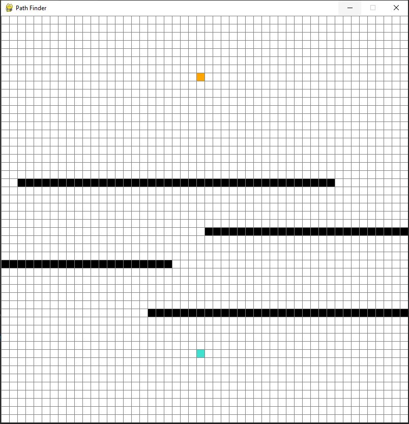
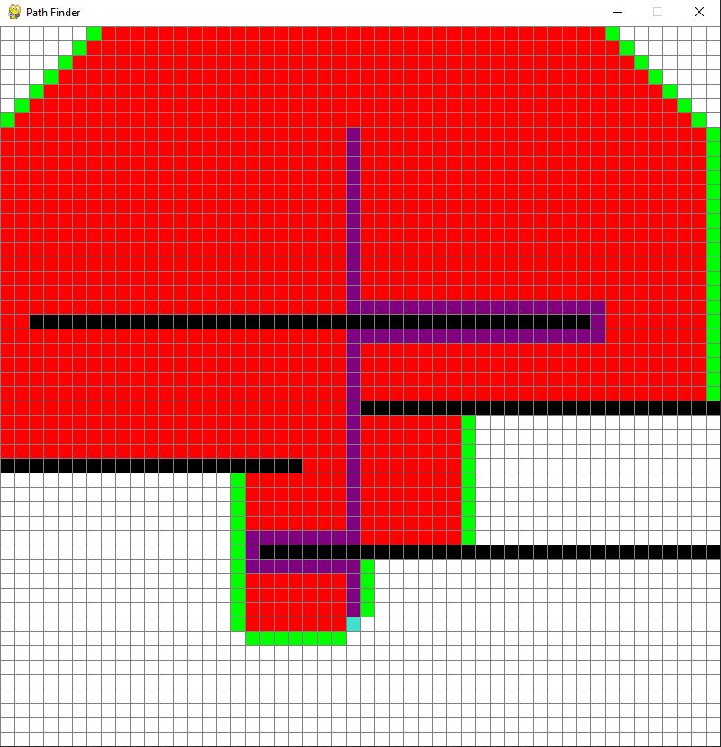

# Pathfinding-Algorithm
> Pathfinding algorithm with visualization done in Pygame.

## Table of contents
* [General info](#general-info)
* [Screenshots](#screenshots)
* [Technologies](#technologies)
* [Setup](#setup)
* [Features](#features)
* [Status](#status)
* [Inspiration](#inspiration)
* [Contact](#contact)

## General info
This program finds the shortest path between two points using A* search algorithm done in python. It also includes a visualisation of path finding done using Pygame.

## Screenshots

## Technologies
* Python - version 3.7
* Pygame

## Setup
To run this project download the files and run the code in any interpreter. You will be able to choose staring and end point and also draw additional barriers.
Press "Space" to run the visiualization.

## Features
List of features ready:
* A* search algorithm done in python.
* Algorithm work visualization in pygame
* Ability to change start and finish points and delate / change barriers 

## Status
Project finished

## Inspiration
Inspired by youtube channel: Tech With Tim

## Contact
[@Piotr Kowalewski](https://pkow.herokuapp.com) - feel free to contact me!
